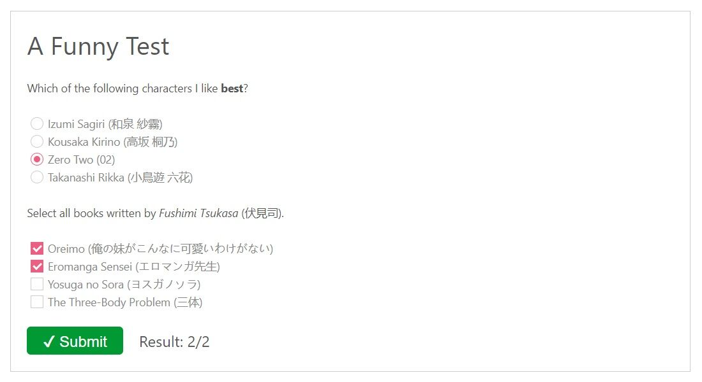

# hexo-helper-quiz

A plugin which helps build quizzes quickly.

## Getting Start

```bash
$ npm install hexo-helper-quiz
```

## Usage

```markdown


<!-- Single choice questions -->
Which of the following characters I like **best**?
--------------------------------------------------
( ) Izumi Sagiri (和泉 紗霧)
( ) Kousaka Kirino (高坂 桐乃)
(x) Zero Two (02)
( ) Takanashi Rikka (小鳥遊 六花)

<!-- Multiple choice questions -->
Select all books written by _Fushimi Tsukasa_ (伏見 司).
-------------------------------------------------------
[x] Oreimo (俺の妹がこんなに可愛いわけがない)
[x] Eromanga Sensei (エロマンガ先生)
[ ] Yosuga no Sora (ヨスガノソラ)
[ ] The Three-Body Problem (三体)


```



## Feature

- Friendly grammar.
- Markdown is supporting.

## TODO

- [ ] leancloud statistics

## LICENSE

MIT

